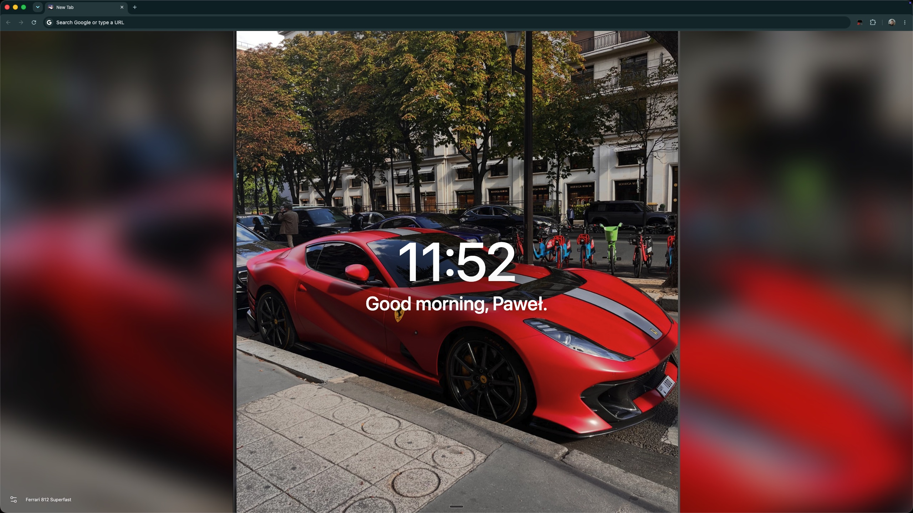
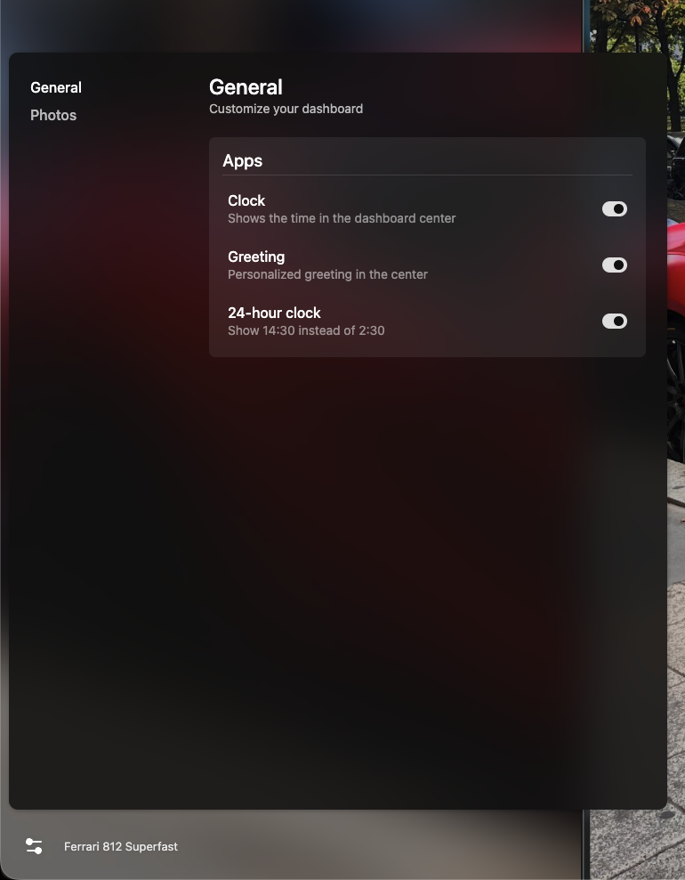
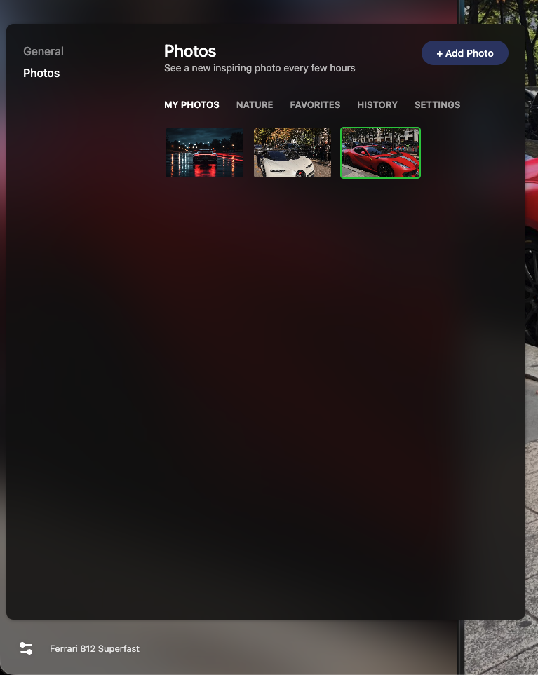
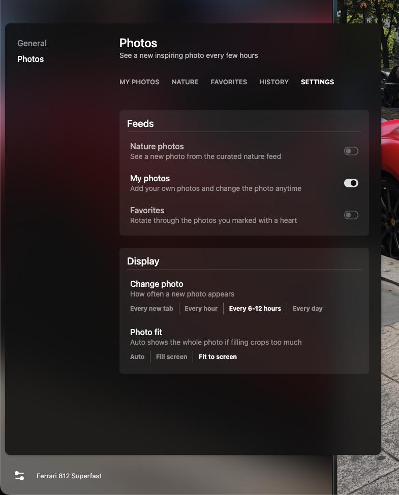

# Momentum Lite

A free Chrome new tab that looks like Momentum: big clock, "Good morning, Paweł.", and a beautiful photo. Use your own photos (Momentum charges for that) or 100 built-in nature photos. Works offline, no account.



## Install

1. Download this repo (Code > Download ZIP) and unzip it.
2. In Chrome, go to `chrome://extensions`.
3. Turn on **Developer mode** (top right).
4. Click **Load unpacked** and pick the `extension` folder.
5. Open a new tab. Done.

Have the real Momentum? Turn it off, only one extension can own the new tab.

Text looks small? Press Cmd + = on the new tab. Chrome remembers the zoom.

## How to use

Click the sliders icon in the bottom-left corner.

**General:** show or hide the clock and greeting, 24-hour clock. Hover the greeting and click "..." to edit your name.



**Photos > My Photos:** click + Add Photo or drop images anywhere on the page. Hover a photo to edit its location or delete it.



**Photos > Settings:** pick where photos come from, how often they change, and how they fit the screen.



Click the location text at the bottom left to favorite the photo or skip to the next one.

## Details

- Feeds: Nature photos, My photos or Favorites. An empty feed falls back to Nature photos.
- Change photo: every new tab, every hour, every 6-12 hours (default, random) or every day (at 4:00). No repeats until the feed runs out.
- Photo fit: Fill screen crops the photo, Fit to screen shows all of it over a blurred copy. Auto (default) fits when filling would crop more than 35%.
- Your photos are shrunk to 2560px and saved in this Chrome profile (IndexedDB). Removing the extension deletes them.
- Nature photos are from Wikimedia Commons, credits in `extension/photos/stock.json`.

## Tests

Headless Playwright Chromium with a temp profile, never your real Chrome:

```
NODE_PATH=$(npm root -g) node tests/e2e.cjs
```

Screenshots land in `/tmp/momentum-clone-shots/`.
